.. _configuration:

*************
Configuration
*************

The GA4GH reference server `Configuration file`_. allows Flask and application
specific configuration values to be set.

------------------
Configuration file
------------------

The GA4GH reference server is a `Flask application <http://flask.pocoo.org/>`_
and uses the standard `Flask configuration file mechanisms
<http://flask.pocoo.org/docs/0.10/config/>`_.
Many configuration files will be very simple, and will consist of just
one directive instructing the server where to find the data repository;
example, we might have

.. code-block:: python

    DATA_SOURCE = "/path/to/registry.db"

For production deployments, we shouldn't need to add any more configuration
than this, as the other keys have sensible defaults. However,
all of Flask's `builtin configuration values <http://flask.pocoo.org/docs/0.10/config/>`_
are supported, as well as the extra custom configuration values documented
here. For information on preparing a data source see :ref:`datarepo` .

When debugging deployment issues, it can be very useful to turn on extra debugging
information as follows:

.. code-block:: python

    DEBUG = True

.. warning::

    Debugging should only be used temporarily and not left on by default.
    Running the server with Flask debugging enable is insecure and should
    never be used in a production environment.

++++++++++++++++++++
Configuration Values
++++++++++++++++++++

DEFAULT_PAGE_SIZE
    The default maximum number of values to fill into a page when responding
    to search queries. If a client does not specify a page size in a query,
    this value is used.

MAX_RESPONSE_LENGTH
    The approximate maximum size of the server buffer used when creating
    responses. This is somewhat smaller than the size of the JSON response
    returned to the client. When a client makes a search request with a given
    page size, the server will process this query and incrementally build
    a response until (a) the number of values in the page list is equal
    to the page size; (b) the size of the internal buffer in bytes
    is >= MAX_RESPONSE_LENGTH; or (c) there are no more results left in the
    query.

REQUEST_VALIDATION
    Set this to True to strictly validate all incoming requests to ensure that
    they conform to the protocol. This may result in clients with poor standards
    compliance receiving errors rather than the expected results.

INITIAL_PEERS
    When starting, you can set a list of initial peers to contact using a
    simple text file. Add a URL per line for peers you would like to add to
    the registry as initial peers. Each time the server starts, this set of
    peers will be announced and added to the registry.

LANDING_MESSAGE_HTML
    The server provides a simple landing page at its root. By setting this
    value to point at a file containing an HTML block element it is possible to
    customize the landing page. This can be helpful to provide support links
    or details about the hosted datasets.

OIDC_PROVIDER
    If this value is provided, then OIDC is configured and SSL is used. It is
    the URI of the OpenID Connect provider, which should return an OIDC
    provider configuration document.

OIDC_REDIRECT_URI
    The URL of the redirect URI for OIDC. This will be something like
    ``https://SERVER_NAME:PORT/oauth2callback``. During testing
    (and particularly in automated tests), if TESTING is True, we can have
    this automatically configured, but this is discouraged in production,
    and fails if TESTING is not True.

OIDC_CLIENT_ID, OIDC_CLIENT_SECRET
    These are the client id and secret arranged with the OIDC provider,
    if client registration is manual (google, for instance). If the provider
    supports automated registration they are not required or used.

OIDC_AUTHZ_ENDPOINT, OIDC_TOKEN_ENDPOINT, OIDC_TOKEN_REV_ENDPOINT
    If the authorization provider has no discovery document available, you can
    set the authorization and token endpoints here.

CACHE_DIRECTORY
    This directory is used to share data between processes when the server is
    run in a production environment. It defaults to ``/tmp/ga4gh/``.

SECRET_KEY
    The secret key used by the server to encrypt cookies. Preferably, this
    should be a long (~24 characters) random string, however any string will
    work.

AUTH0_ENABLED
    When set to true, enables authentication via Auth0.

AUTH0_SCOPES
    These are the login identity providers that an Auth0 application is 
    configured to accept. More about scopes can be seen 
    `here <https://auth0.com/docs/scopes>`_.

AUTH0_CALLBACK_URL
    This configuration value let's Auth0 know which URL to return a session
    to after authentication. It should match the setting in your Auth0
    configuration.

AUTH0_HOST
    The Auth0 host is the domain under which the Auth0 account is hosted.

AUTH0_CLIENT_ID
    Each application is authenticated to your Auth0 account using a Client
    ID and secret. This is available in the Auth0 configuration.

AUTH0_CLIENT_SECRET
    The client secret is a preshared key between your instance of the server
    and Auth0 and is available in the Auth0 configuration panel.

AUTHORIZED_EMAILS
    A comma separated list of user

-------------------------
Configuring Auth0 Service
-------------------------

First login or sign up in Auth0 website: https://auth0.com/

+++++++++++++++
Creating Client
+++++++++++++++

On tab ``Client`` click in ``Create Client``. Give a name for your
Client and choose the ``Non Interactive Clients`` client type. Click
``Create``.

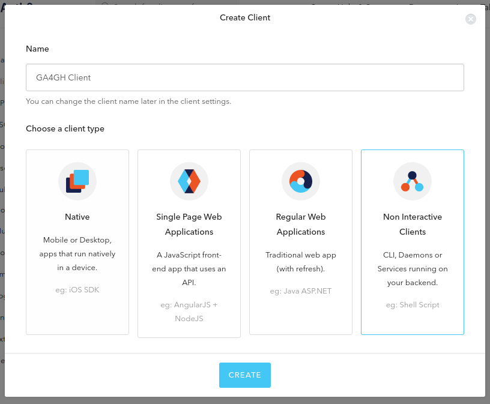

In ``Settings`` tab copy the ``Domain``, ``Client ID`` and
``Client Secret`` data.

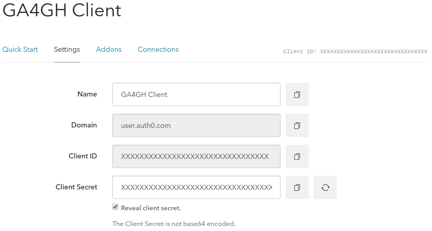

These data will be used to set the following server configuration values
(`reference <http://ga4gh-reference-implementation.readthedocs.io/en/latest/configuration.html#configuration-values>`__):
- ``AUTH0_HOST`` with ``Domain``; - ``AUTH0_CLIENT_ID`` with
``Client ID``; - ``AUTH0_CLIENT_SECRET`` with ``Client Secret``.

Fill ``Allowed Callback URLs``, ``Allowed Logout URLs`` and
``Allowed Origins (CORS)`` with the web address of server endpoint plus
the related path.

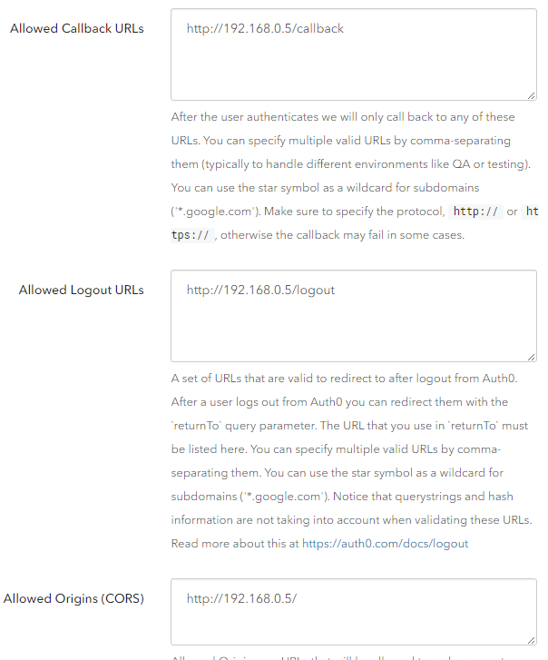

++++++++++++
Creating API
++++++++++++

Go to ``APIs`` tab and click in ``Create API``. The ``Identifier``
should be the URL of server endpoint (the landing page). For this
example I am using root path and TCP port 80.

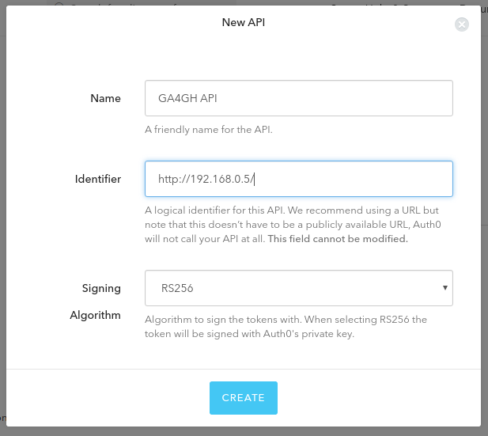

On ``Scopes`` tab, create two scopes: ``openid`` and ``email``.

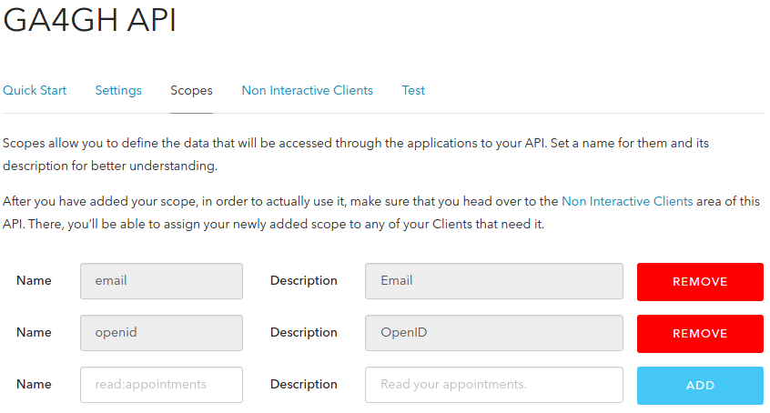

On ``Non Interactive Clients`` tab, authorize the previous created
Client. Select both scopes ``openid`` and ``email``. Click ``Update``
then ``Continue``.

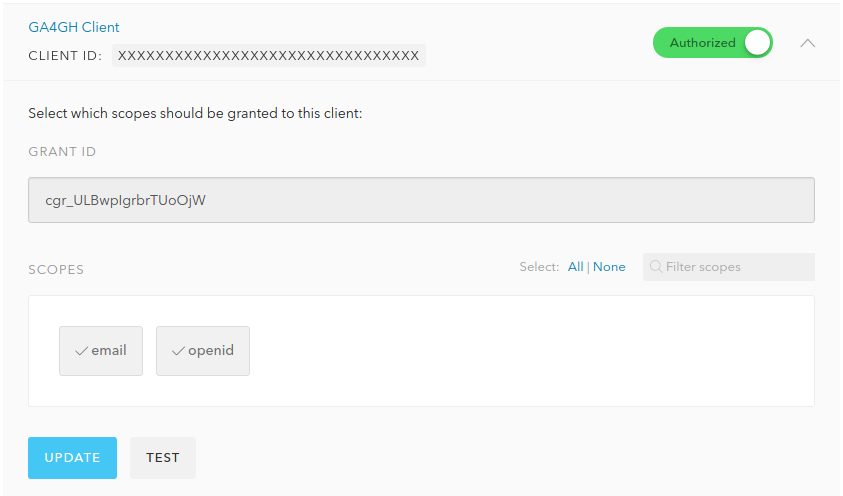

+++++++++++++++++++++++++++++
Creating Database Connections
+++++++++++++++++++++++++++++

Go to ``Connections-Database`` tab and click ``Create DB Connection``. I
disabled sign ups because I want to have control over user creation
allowing only certain people/software to have access on server.

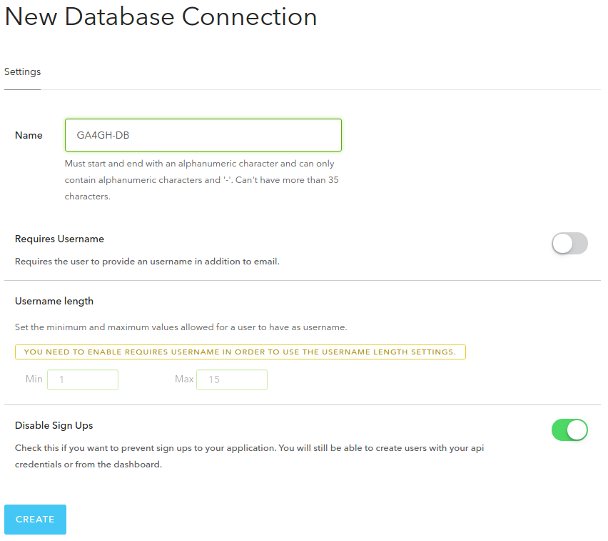

In ``Clients`` tab, activate the connection between the Client and the
Database.

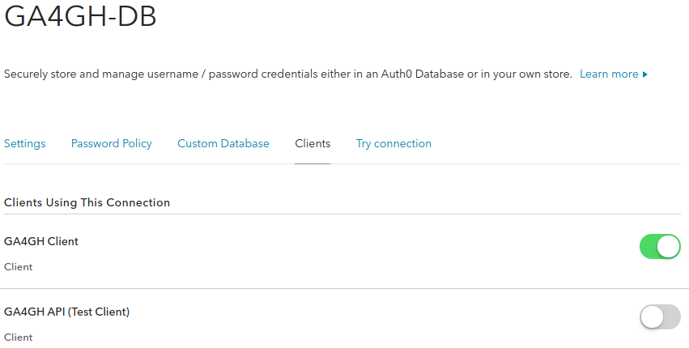

++++++++++++++
Creating Users
++++++++++++++

Go to ``Users`` tab and click ``Create User``. Fill the fields.
``Connection`` should be same one previously created. An email will be
send requesting to verify. I recommend creating your own user for
testing purposes.

.. figure:: images/auth0-create-user.png
   :alt: create\_user

+++++++++++++++++++++++++++++++++++++++++++
Setting up GA4GH server with authentication
+++++++++++++++++++++++++++++++++++++++++++

Append the following server configuration values to ``config.py`` file
(`reference <https://github.com/ga4gh/server/pull/1470>`__). Remember to
update the fields correctly. Create a SECRET\_KEY. I didn’t understand
the field ``AUTH0_AUTHORIZED_EMAILS``. I just used the same email I used
to login into Auth0 website.

::

    AUTH0_ENABLED = True
    SECRET_KEY = "super_secret"
    AUTH0_SCOPES = "openid email"
    AUTH0_CALLBACK_URL = "http://192.168.0.5/callback"
    AUTH0_HOST = "USER.auth0.com"
    AUTH0_CLIENT_ID = "XXXXXXXXXXXXXXXXXXXXXXXXXXXXXXXX"
    AUTH0_CLIENT_SECRET = "XXXXXXXXXXXXXXXXXXXXXXXXXXXXXXXXXXXXXXXXXXXXXXXXXXXXXXXXXXXXXXXX"
    AUTH0_AUTHORIZED_EMAILS = "name@host.com"

Restart the server.

+++++++
Testing
+++++++

Finally access server landing page. It will show an error and a link to
login. At login page, use the same email and password used to create a
user. Note that it does not have an option to create a user (it can be
changed).

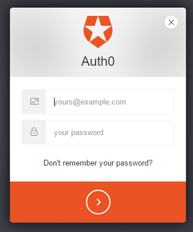

After login you will see the token page.

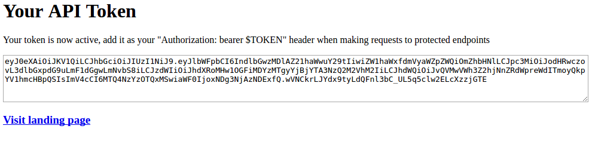

------------------------
OpenID Connect Providers
------------------------

The server can be configured to use OpenID Connect (OIDC) for authentication.
As an example, here is how one configures it to use Google as the provider.

Go to https://console.developers.google.com/project and in create a project.

.. image:: images/Create_project.png

Navigate to the project -> APIs & auth -> Consent Screen and enter a product
name

.. image:: images/Consent_screen_-_ga4gh.png

Navigate to project -> APIs & auth -> Credentials, and create a new client ID.

.. image:: images/Credentials_-_ga4gh.png

Create the client as follows:

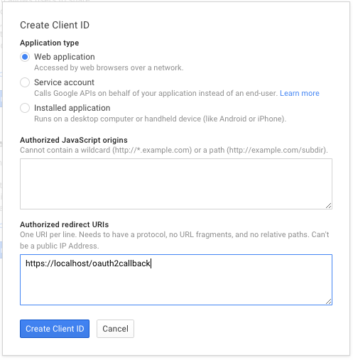

Which will give you the necessary client id and secret. Use these in the OIDC
configuration for the GA4GH server, using the `OIDC_CLIENT_ID` and
`OIDC_CLIENT_SECRET` configuration variables. The Redirect URI should match
the `OIDC_REDIRECT_URI` configuration variable, with the exception that the
redirect URI shown at google does not require a port (but the configuration
variable does). Finally, set the `SECRET_KEY` to any string for storing
cookies.

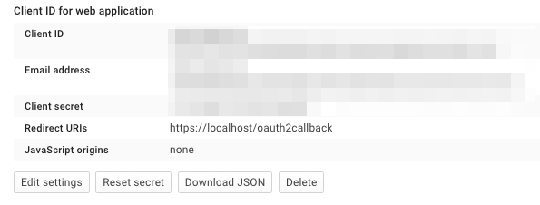
