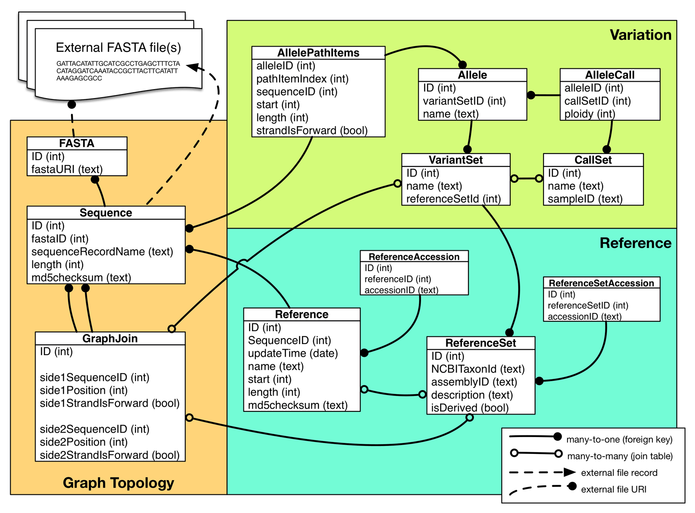

.. _graphs:

************
Graph Server
************

The graph server branch represents experimental support for the graph portion
of the v0.6 (alpha) GA4GH API.

--------------------
Parallel Development
--------------------

The graph server is for the moment being developed on a parallel branch to the "classic" reference server. It is a rapidly evolving project, and functionality is quickly being added to it. If you see any siginificant gaps or issues, please contact maciek@soe.ucsc.edu

-----------
SQL Backend
-----------

Genome graphs are provided to the GA4GH server as an SQLite database, that conforms
to the following `schema 
<https://github.com/ga4gh/server/blob/graph/tests/data/graphs/graphSQL_v023.sql>`_. 

Also take a look at this `example SQL input file 
<https://github.com/ga4gh/server/blob/graph/tests/data/graphs/graphData_v023.sql>`_. representing a simple graph in the required input format.
